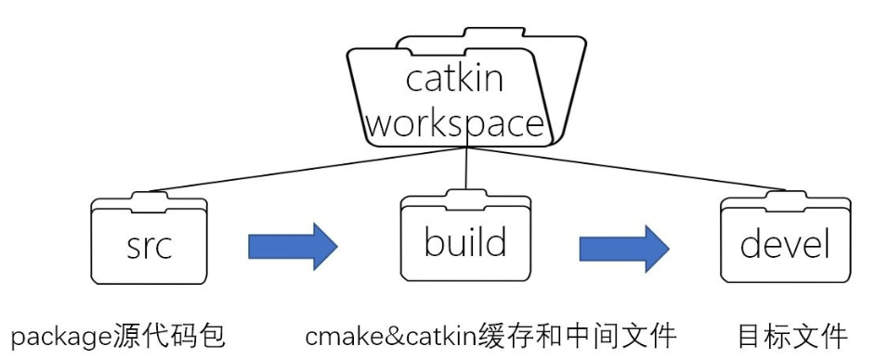
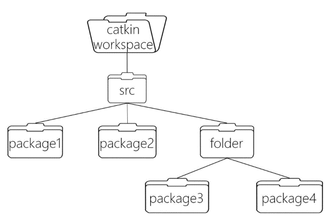
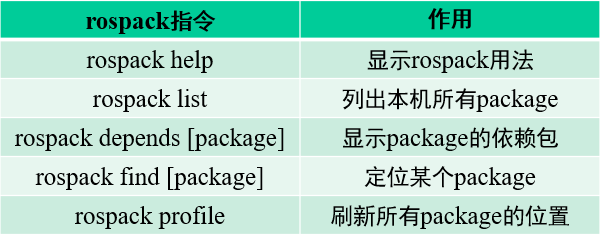
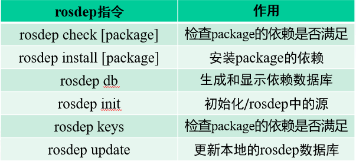

# 智能无人机技术设计实践课件 -- ROS基础
## 1. ROS简介

### 1.1 ROS 的起源

本世纪初，人工智能的研究热潮席卷全球，各种不同功能、不同结构的AI项目大量的出现。人们需要一个有完整标准，统一接口和协议的AI搭建平台来便捷的开发不同的AI系统。
斯坦福大学人工智能实验室创立了STAIR（Stanford Artificial Intelligence Robot）项目，并组创建了灵活的、动态的软件系统的原型，用于机器人技术。
在2007年，机器人公司Willow Garage和该项目组合作，他们十分具有前瞻性的，提供了大量资源进一步扩展了这些概念，经过具体的研究测试实现之后，大量的研究人员将他们的专业性研究贡献到ROS核心概念和其基础软件包，为ROS丰富的功能打下了基础。ROS软件的开发自始至终采用开放的BSD协议，在机器人技术研究领域逐渐成为一个被广泛使用的平台。

### 1.2 什么是ROS

- 机器人的开发是一个庞杂的系统工程，涉及到机械、电子、控制、通信、软件等等诸多领域，个人独自开发面临着很多挑战。
- 随着机器人产业分工的细化，各个部件如底盘、电机、摄像头等分由不同的厂家进行生产，而各个部件需要一个统一的控制平台来完成集成。ROS操作系统就提供了这样一个平台来方便的进行机器人的操作。
- ROS作为一个机器人编程框架或者说机器人的“操作系统”，为各个零散的部件提供了通信的架构和标准，使机器人的感知、决策、控制算法可以更便捷、更精确的进行。
- ROS具有分布式点对点的特点，让每一个进程可以以独立的形式存在并运行，便于模块化操作下的功能实现和修改。
 

## 2. ROS文件系统

### 2.1Catkin编译系统
- ROS系统支持的编程语言主要是**C和Python**两种。源代码包需要经过编译才能被ROS所理解。ROS选用了CMake这一编译工具，并对其进行了扩展，形成了ROS使用的**Catkin编译系统**。
- 一个Catkin系统的软件包（Package）必须要包含两个文件：
**package.xml**：包含了Package的描述，例如包名, 功能描述, 版本号, 包作者等
**CMakeList.txt**：构建Package 所需的CMake文件
- Catkin封装后CMake编译工具操作简单，一个Package编译过后可重复使用，非常方便。

### 2.2Catkin工作空间
- **Catkin工作空间是创建、修改、编译catkin软件包的目录**。它相当于一个仓库，装载着ROS的各种项目工程，便于系统组织管理调用。在Linux下Catkin工作空间是一个文件夹，所有的ROS工程都以package的形式放在这个文件夹里。
Catkin工作空间的结构如下：

 

- **/src**：储存package软件包，是源代码的仓库
- **/build**：CMake的缓存信息和中间文件
- **/devel**：编译生成的环境变量和目标文件（头文件、动态链接库、静态链接库、可执行文件等）
- /build和/devel两个路径由Catkin编译自动生成并管理，通常不需要涉及。
- 写好的软件包以package文件夹为单位储存在/src里，每次编译Catkin会自动递归查找并编译所有在/src里的package，因此也可以把几个package放在同一个文件夹下，如：

### 2.3 Package软件包
- Package软件包是catkin编译的基本单元，任何ROS程序都需要组织成Package才可以进行编译。ROS的源代码就储存在Package里，一个Package可以视作为一个完整的工程组，就像C++里的一个Project。
- Package中的文件、路径如下：
**CMakeList.txt**：定义Package的编译规则，必需成分
**package.xml**：Package的描述文件，必需成分
**src/**：存放.cpp和.py源代码的路径）
**include/**：存放C++源码对应的头文件
**scripts/**：存放可执行脚本的路径，例如.sh和.py
**msg/**：存放自定义格式的消息.msg
**srv/**：存放自定义格式的服务.srv
**launch/**：存放launch文件.launch

Package相关的操作命令
- rospack指令
rospack是对package管理的工具，用法如下表：

- roscd指令
      roscd [package]：直接cd到该package的路径下
- rosls指令
	rosls [package]：直接列出该package中的内容
rosdep指令
	rosdep是package管理依赖项的	工具，用法如下表：

注：常使用rosdep install --from-paths src --ignore-src --rosdistro=kinectic -y 来安装工作空间中src/路径下所有package的依赖项。依赖项由每个package的package.xml指定。

### 2.4 CMakeLists.txt文件与Package.xml文件

- CMakeList.txt文件
CMakeList.txt原本是CMake编译系统的规则文件，Catkin编译系统是在CMake编译系统上扩展得到的，故直接保留了这个规则文件，只是针对ROS工程添加了一些定义。

- package.xml文件
package.xml也是一个catkin的package必备文件，它是这个软件包的描述文件，包含了package的名称、版本号、内容描述、维护人员、软件许可、编译构建工具、编译依赖、运行依赖等信息。

### 2.5 其他文件

- launch文件
launch文件一般以.launch或.xml结尾，它对ROS需要运行程序进行了打包，通过一句命令来启动。一般launch文件中会指定要启动哪些package下的哪些可执行程序，指定以什么参数启动，以及一些管理控制的命令。 launch文件通常放在软件包的launch/路径中。

- msg/srv/action文件
ROS程序中有可能有一些自定义的消息/服务/动作文件，为程序的发者所设计的数据结构，这类的文件以.msg, .srv, .action结尾，通常放在package的msg/, srv/, action/路径下。

- yaml文件
yaml文件一般存储了ROS需要加载的参数信息，一些属性的配置。通常在launch文件或程序中读取.yaml文件，把参数加载到参数服务器上。通常我们会把yaml文件存放在param/路径下。

