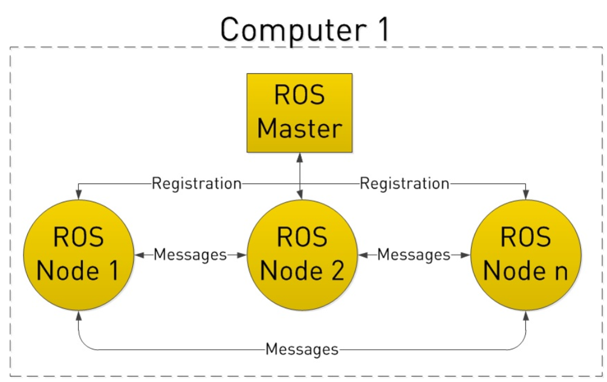
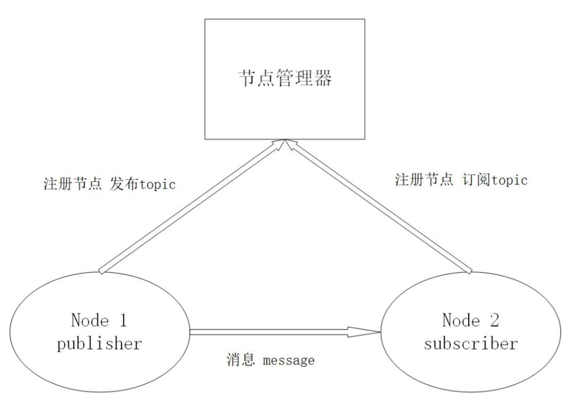
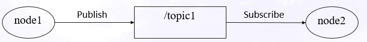
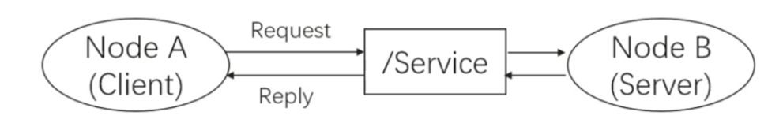
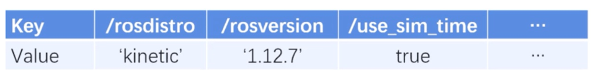

# 智能无人机技术设计实践课件 -- ROS通信
## 1. ROS通信架构基础

### 1.1 Node

- 在ROS世界里，最小的进程单元就是节点（node）。 
- 一个软件包里可以有多个可执行文件，可执行文件在运行之后就成了 一个进程(process)，这个进程在ROS中就叫做**节点**。
- 从程序角度来说，node就是一个可执行文件（通常为C++编译生成的 可执行文件、Python脚本）被执行，加载到了内存之中；从功能角度 来说，通常一个node负责者机器人的某一个单独的功能。- 由于机器人的功能模块非常复杂，我们往往不会把所有功能都集中到 一个node上，而会采用分布式的方式，把鸡蛋放到不同的篮子里。
- 例如有一个node来控制底盘轮子的运动，有一个node驱动摄像头获取 图像，有一个node驱动激光雷达，有一个node根据传感器信息进行路 径规划。
- 这样可以很方便的对各个模块进行修改和异常处理。

### 1.2 Master

- 由于机器人的元器件很多，功能庞大，因此实际运行时往往会运行众 多的node，负责感知世界、控制运动、决策和计算等功能，这就需要 一个管理器来调配、管理这些node。 
- ROS提供给我们一个节点管理器master, master在整个网络通信架构里 相当于管理中心，管理着各个node。
- node首先在master处进行注册，之后master会将该node纳入整个ROS 程序中。
- node之间的通信也是先由master进行“牵线”，才能两两的进行点对 点通信。
- 当ROS程序启动时，第一步首先启动master，由节点管理器处理依次 启动node

### 1.3 Node和Master的关系图

### 1.4 Launch文件

机器人是一个系统工程，通常一个机器人运行操作时要开启很多个node。ROS提供了Launch文件来避免每次启动某个package时依次开启其中每一个node的繁琐操作。
Launch文件储存在package的/launch目录下，每一个Launch文件指定了对于这个package的一种启动方式，包括开启哪些节点、读取哪些配置文件，预置哪些参数等等。

## 2. ROS的三种主要通信方式

### 2.1 Topic

- **话题（Topic）** 是ROS通信方式中最常用的一种，通常用来传输实时性、周期性的消息。Topic是一种node和node之间的**单向通信方式**。
- 一个Topic通信模型中包含两类节点——Publisher和Subscriber。两种节点都需要在Master处注册。Publisher会以一定频率把信息发布到与其绑定的Topic上，Subscriber可以订阅一个或数个Topic。整个通信过程是**单向的**，信息从Publisher单向流向Subscriber。
  

	
- Topic是一种**异步通信方式**。node1是Publisher，它以一定的频率将新的信息更新到/topic1这个Topic上。而node2作为Subscriber，在检测到/topic1更新的时候，调用回调函数（callback）拿到/topic1中的数据并进行处理。一个Topic可能同时存在多个Publisher和Subscriber。

- 对于Publisher来说，它并不关心当前Topic的状态和接受的情况，它只负责按照自己的设定更新Topic。同样，对于Subscriber来说，它也不关心当前Topic由谁写入，它只负责在每次Topic更新的时候进行接收和处理。两者各司其职，不存在协同工作，故称为异步通信。

### 2.2 Message	
- Topic有很严格的格式要求，保证发送方和接收方能够通过Topic正常地进行通信。这个格式我们称为**消息（Message，文件名为msg）**。每一个Topic都需要一个Message来对其格式进行规范，而一个Message格式可以指导多个Topic。
- Msg可以涵盖的基本类型包括bool、int8、int16、int32、int64(以及uint)、float、float64、string、time、duration、header、可变长数组array[]、固定长度数组array[C]。一个Msg里可以包含数个变量，每次信息传递的过程中所有的变量都需要被赋值。
- Msg以.msg文件的形式存放在/package/msg路径下。每一种不同的Msg都需要在CMakeList.txt中进行登记，这样编译的时候ROS系统会对所有的.msg进行编译并生成一个对应的格式，从而用于Topic的通信。

### 2.3 Service

- 当单向的通信不能满足设计需求或不需要周期性传递信息时，ROS提供了服务（ Service ）这一通信方式，来实现一种请求-查询式的**双向同步通信模型**。
- Service的通信模型中包含请求方（Client）和应答方（Server）两类节点。当Client有需求时，它会发送一个请求（Request），并等待回应。Server收到请求并处理后返回一个回应（Reply），Client接收到Reply并对其进行处理，完成通信。整个通信过程是双向的。
- 通常一个Service只有一个Server，并且允许多个Client对其进行询问。
  
  

Service是一种同步通信方式。当Client发送Request后，它会进入阻塞状态，即在原地进行等待，直到接收到Reply才继续执行，故称之为同步通信。当Server接收到Request时，它会调用处理函数（handle_function）对接收到的Request中的信息进行处理并返回一个Reply。这个过程对于Server是FIFO（First in First out，先入先出）的，Server会按照接收Request的次序处理每一个Request并返回Reply。
Service相对于Topic的特点是**双向、同步**。它的通信较为稀疏，在不需要频繁通信的情况下可以节省通信资源，简单而高效。

### 2.4 Srv	

- 与Topic相同，Service也有相应的格式要求。这个格式我们称为服务（Service，文件名为srv）。每一个Service都需要一个Srv来对其格式进行规范，一个Srv格式可以指导多个Topic。
- Srv涵盖的变量格式与Topic相同。一个Srv里可以包含数个变量，每次信息传递的过程中所有的变量都需要被赋值。
- 与Topic不同的是，Srv文件分为Request和Reply两部分，分别规定了Request和Reply的格式，。
- Srv以.srv文件的形式存放在/package/srv路径下。与Topic相同，每一种不同的Srv都需要在CMakeList.txt中进行登记。

### 2.5 Parameter Server

- 与Service和Topic不同，参数服务器（Parameter Server）是一种特殊的通信方式。Parameter Server是node存储参数的地方，用于配置参数和全局共享参数。相比于前两种通信方式，Parameter Server更加静态，它维护了一个数据字典，存储着各种参数和配置。
- 这里的字典其实就是指键值对。每一个键（key）对应着一个值（Value）。当node想要查询某个参数值时，只需要给出key，就可以在Parameter Server中索引得到这个key对应的参数值。
- Parameter Server可以通过命令行、launch文件和node源码三种方式进行维护和更改。

