# 智能无人机技术设计实践课件 -- 基于深度学习的视觉技术

## 1. 深度学习

### 1.1 基础知识

- 卷积神经网络是一种受到视觉感知机制启发的深度学习结构。1959年Hubel和Wiesel发现动物 的视觉皮质细胞负责在感知域内探测光照，受其启发，1980年Kunihiko Fukushima提出了一种 新型认知机并被认为是CNN的先驱。
- 1990年，LeCun发表了一篇奠定现在CNN结构的重要文章，他们构建了一个叫做LeNet-5的多 层前馈神经网络，并将其用于手写体识别。就像其他前馈神经网络，它也可以使用反向传播 算法来训练。它之所以有效，是因为它能从原始图像学习到有效的特征，几乎不用对图像进 行预处理。然而由于当时训练数据量的缺乏以及计算能力的不足，LeNet-5无法在复杂问题上 表现的很好，比如大规模图像分类以及视频分类处理。
- 自2006年以来，又有很多方法被提出来以克服在训练 deep CNNs时遇到的困难。其中很重要的一个是AlexNet 网络，它和LeNet-5很相似，但是在图像分类任务上有了 很大的提升。随着AlexNet的成功，又有很多新的神经网 络被提出来以提升它的性能。
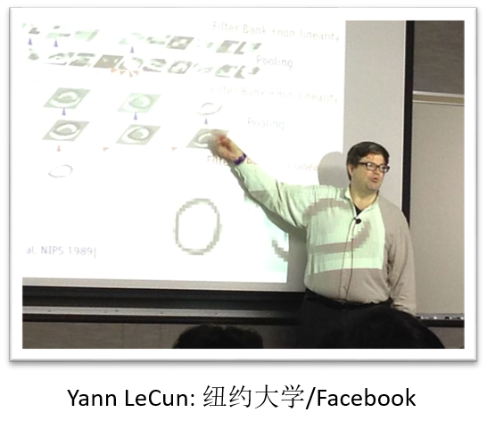

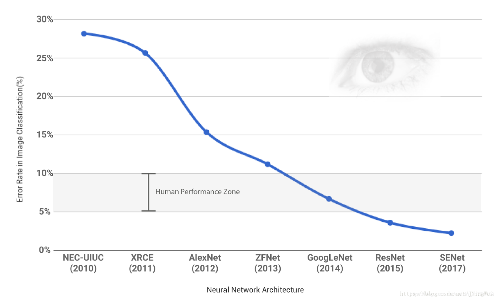
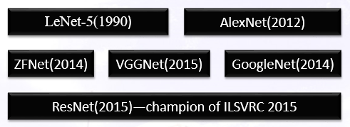
- 上述这些神经网络一个很重要的趋势就是deeper，其中ResNet的深度是AlexNet的20倍，是 VGGNet的8倍。随着深度的增加，网络能够更好的逼近非线性目标方程，并且能够学习到 更加有效的特征。当然这也增加了模型的复杂度，使得模型很难训练并且容易过拟合。所 以有很多方法被提出来用于解决CNNs的训练和过拟合问题。
- 和传统的前馈神经网络类似，整个网络的模型有几种因素决定。我们传统的前馈神经网络 隐藏层一般是全连接的，而CNN的隐藏层又分为convolutional layer，pooling layer和最后的 fully-connected layer，这些隐藏层的区别是CNN之所以为CNN的重要原因，而另外各个神经 元激活函数的选择以及整个网络损失函数的选择都与FNN类似。下面我们主要讲解LeNet-5。
- CNN的应用也很广泛，其中包括图像分类，目标检测，目标识别，目标跟踪，文本检测和 识别以及位置估计等。
- 上面提到CNN和FNN很重要的差异就是隐藏层的差异，CNN有convolutional layer和pooling layer，然后和最后的fully-connected layer共同构成卷积神经网络。而中间的隐藏层的连接 方式又有三个重要的思想:
***convolution operation  and  pooling operation***
***sparse connectivity  and  parameter sharing  and  equivariant representation***

### 1.2 Convolution（卷积）

- CNN的一个重要操作卷积是CNN的核心思想， 就是这个卷积有效的提取了图像特征用于后 面的图像识别。 
- 右图就是一个2维卷积的示意图，这里因为是 离散的卷积，所以可以直接把卷积理解为矩阵 相乘，即两个矩阵相乘，一个是输入矩阵，一 个是卷积核矩阵。输入矩阵一般都表示二维的 输入图像，而卷积核其实可以理解为图像处理 里面的算子，比如这些算子可以实现一些边缘 检测或者高斯模糊的效果，那么其实卷积操作 可以理解为对图像进行一些特征处理。
- 如图所示，一个卷积操作就是指卷积核和同样 大小的一个图像矩阵相乘，然后再向下或者向 右滑动卷积核，执行下一个卷积操作。这样用 卷积核在整个图像上面滑动一遍便生成了一个 卷积层。
- 下图的卷积核大小是2乘以2的，这可以看成是 一个Roberts边缘检测算子，和左面的Input中的 2*2矩阵做卷积运算相当于对点e的边缘检测。
- Roberts算子是一种最简单的算子，它利用局部 差分算子来寻找边缘信息，它采用对角线方向 相邻两像素之差来近似梯度检测边缘
- 𝐺𝐺𝑦𝑦(𝑖𝑖,𝑗𝑗)=𝑓𝑓(𝑖𝑖+1,𝑗𝑗)−𝑓𝑓(𝑖𝑖,𝑗𝑗+1)
- 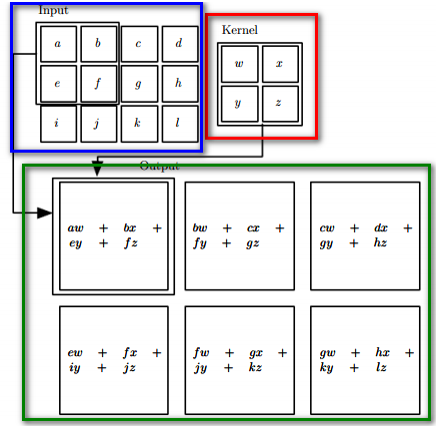

这里的Roberts算子只是一个一阶算子，提取的 边缘信息还很有限，还有其他的二阶算子，比 如拉普拉斯算子。而且这里Roberts算子只提取 了某个像素对角线的梯度，而没有提取垂直方 向和水平方向的梯度，所以还有其他的算子用 于提取多个方向梯度，比如Sobel算子，Prewitt 算子等。

### 1.3 Sparse Connectivity

- 正是由于卷积核的存在，而且卷积核的大小比整 幅图像小，所以才产生了稀疏连接这样的思想。 我们传统的FNN一般是全连接的的，就像右图下 面蓝色框表示，虽然这是一维的，但是和二维同 理，我们可以把卷积核就想成连接权，这时卷积 核和图像大小相同，相当于全连接，所以输出层 中的𝑠𝑠3收到输入层所有神经元的影响。
  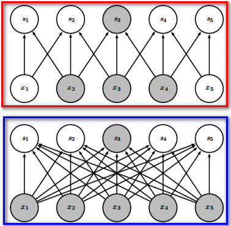
  ***上图中红色框里面的表示稀疏连接***
***上图中蓝色框里面表示非稀疏连接***

上图中红色框里面的表示稀疏连接 上图中蓝色框里面表示非稀疏连接

- 再看红色框里面的连接方式，可以把图像想象成 二维的，这里只展示出了一维信息，而卷积核是 3乘3大小的，所以就产生了连接权的稀疏性，即 最终𝑠𝑠3只受到了三个神经元的影响。
- 这么做是有道理的，就是根据一些生物学的研究 我们的视觉感知细胞其实是局部感知的，比如我 们用很小的卷积核来提取整幅图像的***布局边缘信息***，这时候采用全连接的意义并不大，不能学到 很好的***图像特征信息***，而且模型复杂度还很高。
  

### 1.4 Parameter Sharing

- 第一部分讲到的卷积核在整幅图像上滑动其实就是一种权值共享，因为这里的卷积核代表的其实就是权值，而这个权值用于了整幅图像从而产生了下一层网络，也就是说对于图像的每个局部位置，它们连接到下一层的权值都是一样的，所以权值共享还有另一种叫法，是𝑡𝑖𝑒𝑑weights。
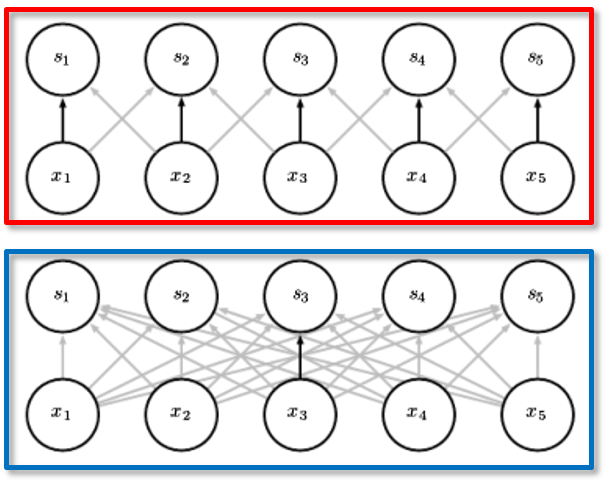
- 上图中的***红色框***中，黑色的箭头表示，在一个卷积网络中一个三维的卷积核的其中一个元素由于左图的权值共享，导致对于所有输入神经元，黑色箭头的值都是相同的。而下面的***蓝色框***中，黑色箭头表示全连接层中所有权值最中心的一个权值，它只使用了一次，没有被任何神经元再次共享。

### 1.5 Convolutional Layer

- 我们现在了解了卷积操作和稀疏连接以及权值共享的思想，由这些其实就可以产生卷积层了。为权值共享，即一个卷积核其实只能提取图像的一种特征，那想要提取图像的多种特征，就需要多个卷积核，每一个卷积核产生一个feature map，如下图是LeNet-5，它的第一个卷积层含有6的feature map，每一个feature map对应一个卷积核，也就对应提取了图像的一种特征。这里注意最终的feature map并不是做完卷积后的结果，然后还要加一个非线性激活的操作，一般用ReLU函数，这个过程一般叫做detector stage。
- 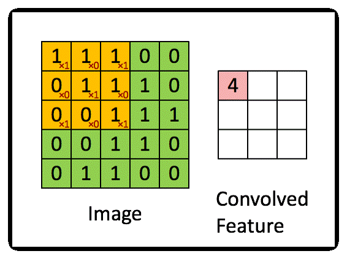

### 1.6 Pooling

- pooling操作是指在生成卷积层以后，图像某块区域的值被这个区域内所有值得统计量所取代，例如max pooling操作就是把一个矩形局域内最大的输出当做这块区域的输出。当然还有其他的pooling function，比如average pooling，weighted average pooling等
- pooling操作很大的用处就是，对于输入图像的局部较小的平移来说，pooling使得卷积操作后得到的特征可以保持对于平移的不变性。给定一幅图像，比如我们在做图像检测，我们只关心某个特征是否在这幅图像中出现了，而它的位置不那么重要，这时候局部平移不变性这个性质，对于我们的工作就很有用。比如我们要做人脸识别，我们并不能精确的知道眼睛在图像的什么像素的位置，只是大概知道在左上角。
 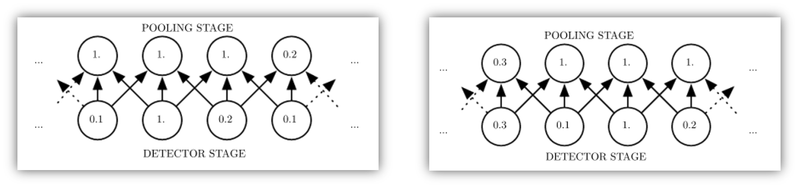
- 上图就是max pooling导致的局部平移不变性，我们可以看到下面的卷积层的输入向右平移了一个神经元，即输入层对应神经元的值都变了，可是上面的pooling层的值只有部分改变了。
这里只是对一个feature map做池化，其实对多个feature map做池化还可能解决旋转不变性的问题。
- ### Pooling Layer 
有了pooling操作，我们就可以产生CNN的另外一种隐藏层了，就是pooling layer，这一层的产生思想明确清晰，操作也简单。
如下图所示，由原始图像应用6个卷积核提取了6个feature map，然后针对这6个feature map做
pooling，还有一种叫法就是subsampling，即子采样，其实就和前面提到的稀疏连接和权值共享一样，池化操作也会大大减少模型的参数。
 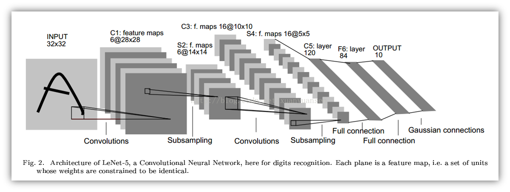
### 1.7 Fully-connected Layer
经过几次的***卷积***以及***池化***操作，网络得到了C5层，它由120个神经元组成，F6即为全连接层和FNN一样。共有(120+1)*84个参数。注意这里F6层最后还要做一次sigmoid非线性变换，最后得到一个84维的二值向量。
最后一层是由欧式径向基函数单元组成，每类1个单元，每个单元有84个输入。即每个RBF单元计算输入向量和参数向量之间的距离，距离越远，RBF越大。最后损失函数就是F6层的神经元与某个RBF神经元的输入权值的差，目标是最小化这个差值。这种表示方法其实对仅仅识别数字不是很有用，但是如果想要识别ASCII集中的字符很有用。
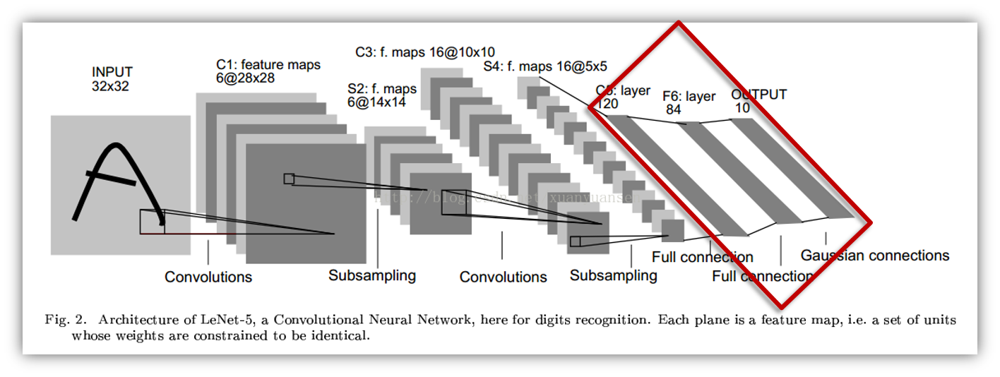

### 1.8 Equivariant Representation 
现在还只有一个思想没有讲，就是不变性，前面在池化的时候已经提到过，池化可以实现局部
平移不变性的效果，甚至可以通过变化实现旋转不变性。但是如果有大范围的平移怎么办那，
是否还存在平移不变性那。这里卷积层和全连接层就对平移不变性起到了很大的作用。

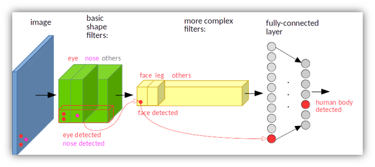
这两幅图表示一个检测人是否存在的CNN绿色和黄色的块都是一系列卷积和池化操作生成的。其中绿色的表示检测到人体的小器官而黄色的则表示检测到大的肢体。
我们可以看到，假设上面的图左下角有个人脸，那么绿色的块中将会在各层的左下角检测到眼，鼻子，嘴等器官，而黄色的快将会在左下角检测到一张人脸。而下面的图人脸在左上角，那么最后就会在左上角检测到一张人脸。虽然两张图最终检测到人脸的位置不同，但是经过全连接层以后，都是有某一个神经元被激活，表示检测到了人脸。
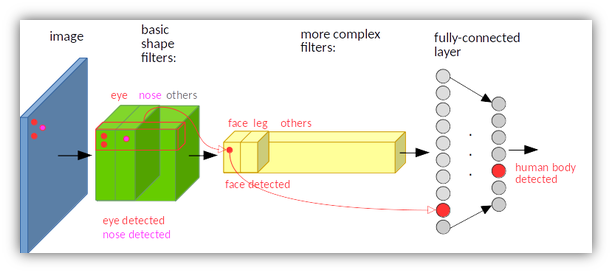

### 1.9 Parameters

- C1有156个参数：(5*5+1)*6=156
- S2有12个参数：因为S2中每个map中的每个点都与C1的四个点相连接进行池化，一般做完
池化操作比如取最大或平均，还要乘以一个数，再加一个bias，再非线性变换
- C3有1516个参数：C3也是通过5*5的卷积核由14*14的map得到10*10的map，不过这里连接
方式有点复杂，共有(5*5*3+1)*6+(5*5+1)*6+(5*5*4+1)*3+(5*5*6+1)*1=1516个参数。
- S4有32个参数：因为有16个池化层，每层都要两个参数，一个池化函数的系数和一个偏置
- C5有48120个参数：(5*5*16+1)*120=48120
- output840个参数：84*10=840
- F6有10164个参数：120+1)*84=10164
- 共有60,840个参数

### 1.10 Training CNN
1. 给出训练样本集  {𝑋_𝑖,𝑌_𝑖 }
2. 根据𝑋_𝑖以及CNN的模型结构，前向传播(forward propagation)
3. 前向传播结果计算出模型输出 𝑦_𝑖，并计算出损失函数 ├ 𝐽(𝜃)=𝐿(𝑦,𝑦′)
4. 根据损失函数进行反向传播(back propagation)，计算出所有参数梯度
5. 根据参数梯度进行梯度下降算法，求取最后模型参数

## 2.目标检测
### 2.1 物体检测定义与应用

- Image  object detection requires that the algorithm tells not only what objects are in the image but also the location of each object.
- Image object detection is a widely researched problem and the foundation of many applications.
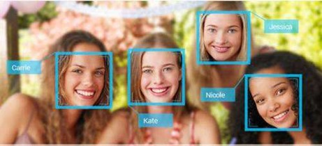    
       Face detection

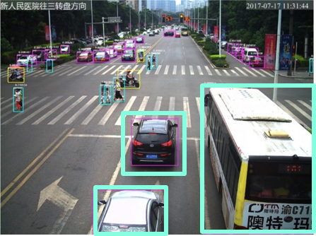 
    Traffic surveillance

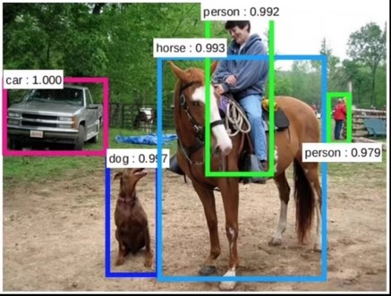
       General object detection

### 2.2 候选区域（Proposal）＋分类（Classification）

- Evolution of Proposal
From  sliding windows to  region proposing
- Evolution of Classification
From Haar filter to SVM
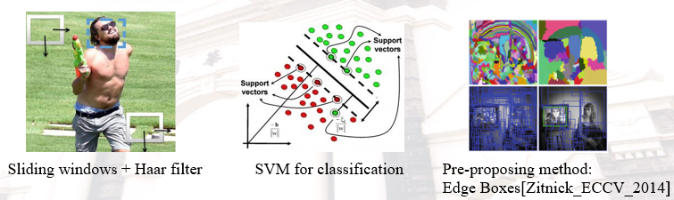

### 2.3 RCNN:  Use CNN instead of SVM as the classifier[Girshick_RCNN_2014].

- Pros: The accuracy of classifier is much higher than SVM
- Cons: Forward CNN for each proposal, computation intensive,
Conv Layers: 6 TOP
FC layers: 50 GOP
Proposal is running on CPU with single thread（Selective Search）
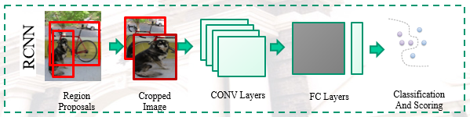

### 2.4 Fast-RCNN:  RCNN + ROI Pooling(Region of Interest) [Girshick_Fast_2015]

- Pros: Run CNN once on the original image to reduce computation
Conv Layers: 120 GOP
FC layers: 50 GOP
- Cons: The region proposing method becomes the bottleneck of the speed of object detection.
Proposal is running on CPU with single thread
Need ROI Pooling operation
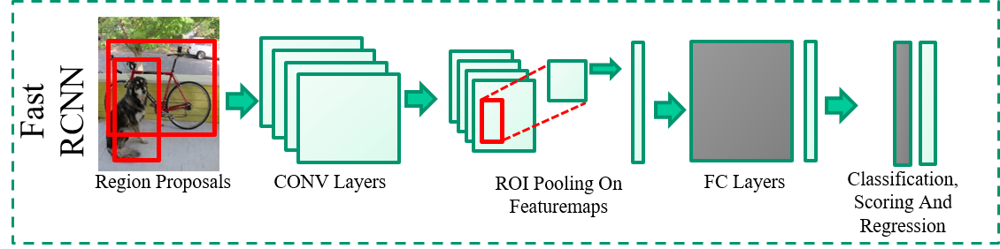

### 2.5 Faster-RCNN: Fast-RCNN + RPN (Region Proposal Network)

- Pros: Use RPN to get the proposals and accelerate this stage.
Conv Layers: 120 GOP
FC layers: 50 GOP
Do not need proposal algorithm
- Cons:  FC layer become the bottleneck.
Compute FC layers many times
Need ROI pooling.

### 2.6 YOLO/SSD  You Look Only Once/ Single Shot multibox Detector.

- Pro: Eliminate the region proposal stage and get the results directly from the CNN results.
No ROI pooling
No proposal stage
- YOLO [Redmon_YOLO_2016]
CONV: 39.8GOP
FC: 0.4GOP
No Branches
- SSD [Liu_SSD_2016]
CONV: 60GOP
No FC layers
5 Branches
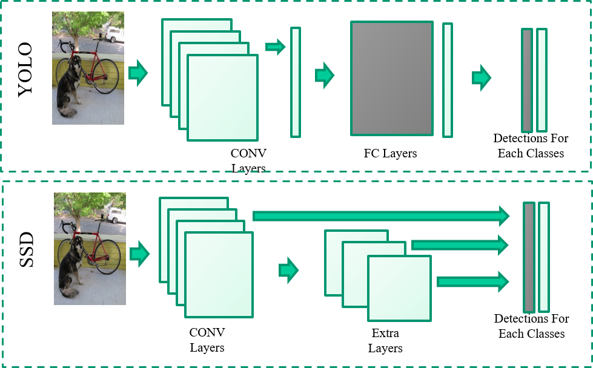

### 2.7 YOLO

- 将检测变为一个 regression problem，YOLO 从输入的图像，仅仅经过一个 neural network，直接得到 bounding boxes 以及每个 bounding box 所属类别的概率。正因为整个的检测过程仅仅有一个网络，所以它可以直接 end-to-end 的优化。

- YOLO 结构十分的快，标准版YOLO 每秒可以实时地处理 45 帧图像。一个较小版本Fast YOLO，可以每秒处理 155 帧图像，它的 mAP（mean Average Precision） 依然可以达到其他实时检测算法的两倍。
- 核心思想
输入：利用整张图作为网络的输入，
输出：直接在输出层回归bounding box的位置和bounding box所
属的类别。
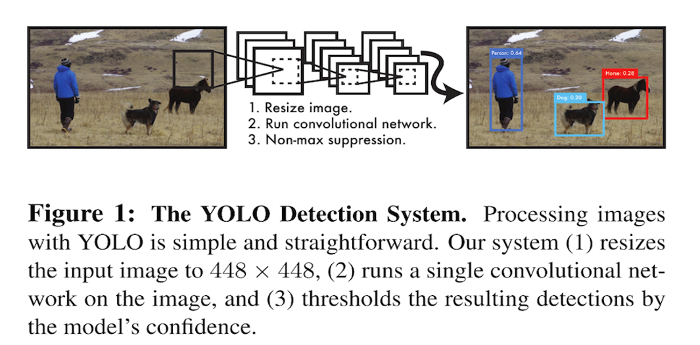

- 将一幅图像分成SxS个网格(grid cell)，如果某个object的中心落在这个网格中，则这个网格负责预测这个object。
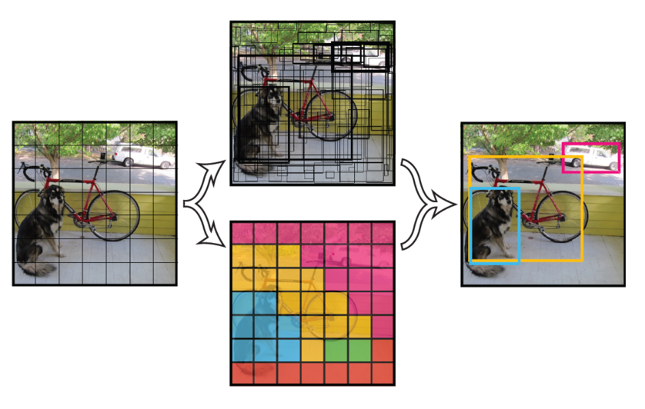
- 每个网格要预测B个bounding box，每个bounding box除了要回归自身的位置之外，还要附带预测一个confidence值，即每个box要预测(x, y, w, h)和confidence共5个值。
- 这个confidence代表了所预测的box中含有object的置信度和这个box预测的有多准两重信息
- 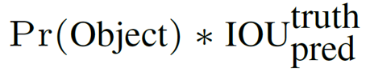
- 其中如果有object落在一个grid cell里，第一项取1，否则取0。 第二项是预测的bounding box和实际的ground truth之间的IOU值。
- 每个bounding box要预测(x, y, w, h)和confidence共5个值，每个网格还要预测一个类别信息，记为C类。则SxS个网格，每个网格要预测B个bounding box还要预测C个categories。输出S x S x (5*B+C)的一个tensor。
注意：class信息是针对每个网格的，confidence信息是针对每个bounding box的。

- 在test的时候，每个网格预测的class信息和bounding box预测confidence信息相乘，就得到每个bounding box的class-specific confidence score:

Pr⁡(Class_i│Object)∗Pr⁡(Object)∗IOU_pred^truth=Pr⁡(Class_i )∗IOU_pred^truth

等式左边第一项就是每个网格预测的类别信息，第二三项就是每个bounding box预测的confidence。这个乘积即表示了预测的b-box属于某一类的概率，也有该box准确度的信息。

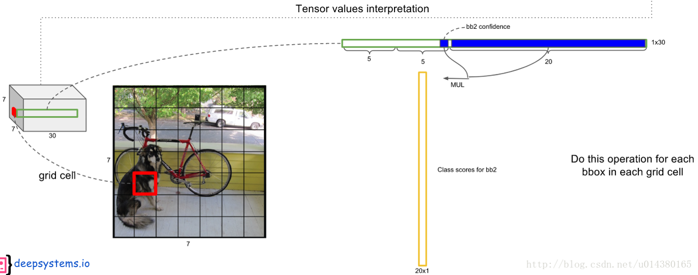
- 图像分成 7×7 个网格(grid cell)，检测20个类别，每个网格要预测2个b-box
- 一个b-box输出张量为 1×(5+5+20）
- 得到 20×(7×7×2) 的矩阵

 - 损失函数
Output：S x S x (5*B+C)的一个tensor
B：(x, y, w, h, confidence)
C：Pi(C) of Category

- 误差 = 定位误差 + 分类误差
- 误差 = 定位误差 + 置信度误差 + 分类误差
- 误差 = 定位误差 + 包含目标的框置信度误差 
	+ 不包含目标的框置信度误差 + 分类误差

