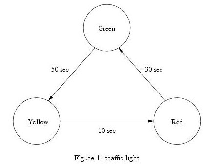
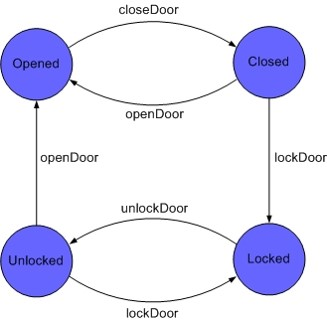
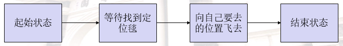
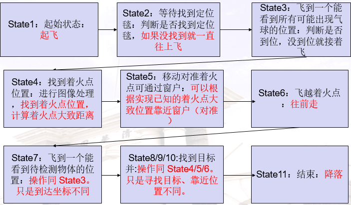

# 智能无人机技术设计实践课件 -- 有限状态机和系统集成

## 1. 系统组织工具——状态机

- 状态机理论最初的发展在数字电路设计领域。
- 【在电路系统中定义】状态机由状态寄存器和组合逻辑电路构成，能够根据控制信号按照预先设定的状态进行状态转移，是协调相关信号动作,完成特定操作的控制中心。在数字电路方面，根据输出是否与输入信号有关，状态机可以划分为Mealy型和Moore型状态机。 Moore型状态机的输出只和当前状态有关，和输入无关。 ——《数字电路与处理器基础》。
- 【将状态机概念应用到软件设计】用来描述一些复杂的算法，表明一些算法的内部的结构和流程，更多的关注于程序对象的执行顺序。
状态寄存器 -> 系统运行状态
组合逻辑电路 -> 在对应状态下的处理程序
状态转移 -> 根据观察和反馈修改状态
###有限状态机
- 有限自动机（Finite Automata Machine）是计算机科学的重要基石，它在软件开发领域内通常被称作有限状态机（Finite State Machine），是一种应用非常广泛的软件设计模式。
- 有限状态机的作用主要是**描述对象在它的生命周期内所经历的状态序列，以及如何响应来自外界的各种事件。**
- 在现实中，有许多事情可以用有限个状态来表达，如: 红绿灯、电话机等等。 其实，在资讯领域中，很多事情都是由有限的状态所组成，再由于不同的输入而衍生出各个状态。 
- 有限状态机FSM思想广泛应用于硬件控制电路设计，也是软件上常用的一种处理方法。它把复杂的控制逻辑分解成有限个稳定状态，在每个状态上判断事件，变连续处理为离散数字处理，符合计算机的工作特点。
- 同时，因为有限状态机具有有限个状态，所以可以在实际的工程上实现。但这并不意味着其只能进行有限次的处理，相反，有限状态机是闭环系统，有限无穷，可以用有限的状态，处理无穷的事务。
- ### 有限状态机—例1
- 红绿灯
红绿灯运作的原理相当简单，从一开始绿灯，经过一段时间后，将变为黄灯， 再隔一会儿，就会变成红灯，如此不断反覆。 其FSM如下。 

- 自动贩售机
假设有简单的一自动贩卖机贩售两类商品，一类售价20元，另一类售价50元。 如果该贩卖机只能辨识10元及50元硬币。 一开始机器处于Hello的状态，当投入10元时，机器会进入余额不足的状态，直到投入的金额大于20元为止。 如果一次投入50元，则可以选择所有的产品，否则就只能选择20元的产品。 完成选择后，将会卖出商品并且找回剩余的零钱，随后，机器又将返回初始的状态。 (五分钟思考下状态转移）
自动贩售机
状态转移从初始状态Hello开始：
状态允许买50元东西的状态可以合并，也可以分立

### 1.1 基本概念
在描述有限状态机时，常会碰到的几个基本概念：
- **状态（State）**　指的是对象在其生命周期中的一种状况，处于某个特定状态中的对象必然会满足某些条件、执行某些动作或者是等待某些事件。 
- **事件（Event）**　指的是在时间和空间上占有一定位置，并且对状态机来讲是有意义的那些事情。事件通常会引起状态的变迁，促使状态机从一种状态切换到另一种状态。 
- **转换（Transition）**　指的是两个状态之间的一种关系，表明对象将在第一个状态中执行一定的动作，并将在某个事件发生同时某个特定条件满足时进入第二个状态。 
- **动作（Action）**　指的是状态机中可以执行的那些原子操作，所谓原子操作指的是它们在运行的过程中不能被其他消息所中断，必须一直执行下去。 

### 1.2 有限状态机模型在系统中应用
- 基本出发点：认为整体系统主要是由响应多个“事件”的相对简单的处理过程组成。
- 开发步骤：
梳理状态转移图
实现各状态处理方法
判断条件完成状态转移
- 优点：简单明了，比较精确。对许多复杂的协议，事件数和状态数虽然增加，但是只要搞清楚了状态转移，对于每个状态下的处理都很简单。
### 1.3 为什么使用有限状态机
- 游戏引擎是有限状态机最为成功的应用领域之一，由于设计良好的状态机能够被用来取代部分的人工智能算法，因此游戏中的每个角色或者器件都有可能内嵌一个状态机。
- 考虑RPG（ Role-playing Game）游戏中城门这样一个简单的对象，它具有打开（Opened）、关闭（Closed）、上锁（Locked）、解锁（Unlocked）四种状态。当玩家到达一个处于状态Locked的门时，如果此时他已经找到了用来开门的钥匙，那么他就可以利用它将门的当前状态转变为Unlocked，进一步还可以通过旋转门上的把手将其状态转变为Opened，从而成功进入城内。
**控制城门的状态机** 

### 1.4 有限状态机编程方法
- 开发步骤：
梳理状态转移图
实现各状态处理方法
判断条件完成状态转移
- 以minicontrol为例
梳理状态转移

## 2. 整体可能的框架

## 3. 初赛评分标准
- 助教会摆放着火点和待检测物体的位置。人工裁判，会给选手发指令开始指令，选手启动程序，助教开始计时，在完成所有任务后停止计时。
完成起飞 ：20 分
完成穿过着火点：60分
穿过目标物体：80分
安稳降落：100分。并登记时间。
- 初赛会选择十支左右队伍进入决赛。依据完成时间、得分多寡进行选拔。
